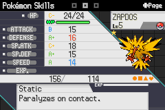
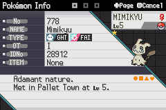
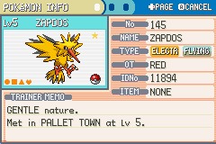

# RadicalRed Savegame Editor

Includes functions for loading Radical Red
savegames, editing team Pokemons and saving
the result into a legit savegame. Currently, it can:

* Load and save valid Radical Red / Fire Red saves.
* Clone and export first team Pokemon.
* Create 'valid' Radical Red Pokemons. All of them
  were caught at Pallet Town, which makes them not
  100% legit.

# Requirements

1. Python 3.7+
2. Any Python package manager.
3. Base FireRed savegame.

# Installation

1. Either download and extract this repo or git clone:
    ```bash
    $ git clone https://gitlab.com/IppSD/radicalred-savegame-editor.git
    ```
2. Go to the extracted folder.
    ```bash
    $ cd radicalred-savegame-editor/
    ```
3. Install Python dependencies...
    1. ... with PIP:
    ```bash
    $ pip install -r requirements.txt 
    ```
    2. ... with Conda:
    ```bash
    $ conda install -r requirements.txt
    ```

# Usage

Import the module ``rr_parser``. The following operations
are permitted:

* **load_radical_red_game(input_filename)**: import
  the savegame for later editing.
* **clone_first_team_pkm(game)**: clone first team Pokemon
  into next free team slot.
* **export_first_team_pkm(game, output)**: export first
  team Pokemon into a file.
* **create_and_insert_pokemon(game, species, \*\*kwargs)**: create
  and insert new Pokemon from input arguments.
* **save_game(game)** export edited savegame.


As example, the following code clones the first Pokemon
(an Articuno), creates a shiny Zapdos with hidden
ability Static and a shiny adamant Mimikyu:

```python3
import rr_parser

RR_FILENAME: str = "savs/rr_savs/rr_i.sav"
RR_OUTPUT_SAVE = "output/savs/GAMEV2.sav"


def test_rr():
    g = rr_parser.load_radical_red_game(RR_FILENAME)
    print(g)

    rr_parser.clone_first_team_pkm(g)
    rr_parser.export_first_team_pkm(g, "output/pkms/Articuno.bin")
    rr_parser.create_and_insert_pokemon(
        game=g,
        species="zapdos",
        shiny=True,
        ability=3
    )
    rr_parser.create_and_insert_pokemon(
        game=g,
        species="mimikyu",
        shiny=True,
        ability=3,
        nature="Adamant"
    )
    rr_parser.save_game(g, RR_OUTPUT_SAVE)
    pass


if __name__ == '__main__':
    test_rr()
    pass

```




The ``main.py`` script included on the repo also
edits a standard FireRed savegame for creating a
'valid' shiny zapdos:



# Bibliography

## Gen3 data structure

1. [Gen3 Savegame Structure](https://bulbapedia.bulbagarden.net/wiki/Save_data_structure_in_Generation_III)
2. [Gen3 Pokemon Data Structure](https://bulbapedia.bulbagarden.net/wiki/Pok%C3%A9mon_data_structure_in_Generation_III)
3. [Gen3 Pokemon Sub-data Structure](https://bulbapedia.bulbagarden.net/wiki/Pok%C3%A9mon_data_substructures_in_Generation_III)
4. [Gen3 Character Encoding](https://bulbapedia.bulbagarden.net/wiki/Character_encoding_in_Generation_III)
5. [Gen3 Locations List](https://bulbapedia.bulbagarden.net/wiki/List_of_locations_by_index_number_(Generation_III))

## Any generation data structure

1. [Game of Origin](https://bulbapedia.bulbagarden.net/wiki/Game_of_origin)
2. [PID](https://bulbapedia.bulbagarden.net/wiki/Personality_value)

## Radical Red documentation & code

1. [Complete Fire Red Upgrade Github](https://github.com/Skeli789/Complete-Fire-Red-Upgrade)
2. [CFRU Documentation](https://raw.githubusercontent.com/Skeli789/Complete-Fire-Red-Upgrade/master/CFRU%20Documentation.pdf)
3. [CFRU Pokemon data structure hints](https://github.com/Skeli789/Complete-Fire-Red-Upgrade/blob/master/include/pokemon.h)
4. [CFRU abilities list](https://github.com/Skeli789/Complete-Fire-Red-Upgrade/blob/master/include/constants/abilities.h)
5. [CFRU moves list](https://github.com/Skeli789/Complete-Fire-Red-Upgrade/blob/master/include/constants/moves.h)
6. [CFRU move stats list](https://github.com/Skeli789/Complete-Fire-Red-Upgrade/blob/master/src/Tables/battle_moves.c)
7. [CFRU level up moves list](https://github.com/Skeli789/Complete-Fire-Red-Upgrade/blob/master/src/Tables/level_up_learnsets.c)
8. [CFRU natures list](https://github.com/Skeli789/Complete-Fire-Red-Upgrade/blob/master/include/constants/pokemon.h)
9. [CFRU Pokemon species list](https://github.com/Skeli789/Complete-Fire-Red-Upgrade/blob/master/include/constants/species.h)
10. [CFRU Pokeballs list](https://github.com/Skeli789/Complete-Fire-Red-Upgrade/blob/c884d332eae3a16a8e8f588ad95abc5ec1ff2abe/include/new/catching.h)

## Code dependencies

1. [PokeAPI Docs](https://pokeapi.co/docs/v2)
2. [Pokebase Docs](https://github.com/PokeAPI/pokebase)